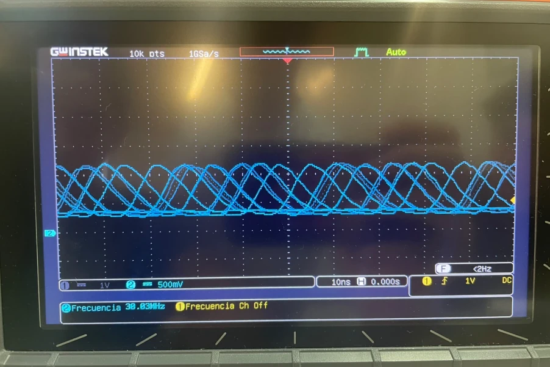

# Session 3 — Comparing SDK GPIO and Register-Level Timing

**Goal (one sentence):** Compare the output signal and execution speed between the SDK's `gpio_put` calls and direct register-level GPIO writes on the Pico 2 W.

**Prediction — written before running anything:** The SDK's `gpio_put` should run slower than writing straight to the SIO registers, since each call goes through extra function-call and pin-validation overhead before it touches the pin; on the scope that should show up as a noticeably lower toggle frequency for the SDK version than for the register-level version.

---

### Setup

- Pin map: `LED` = GP18, driving the LED output; oscilloscope CH probe connected to GP18.

### What I did

1. Wired the Pico 2 W to a breadboard and started a new "Blink" project from the VS Code Pico extension.
2. Flashed and ran the SDK version (`gpio_put`) first.
3. Connected and calibrated the oscilloscope to read the toggle frequency.
4. Replaced the SDK calls with direct writes to `sio_hw->gpio_set` / `sio_hw->gpio_clr`.
5. Measured again with the oscilloscope, same settings.

### Evidence



This is the signal we captured on the register-level version: **38.03 MHz**, toggling with no delay between writes — dramatically faster than the SDK version, which matches the prediction that removing `gpio_put`'s call overhead lets the pin toggle much faster.

### What went wrong

- Our Pico 2 W burned out partway through the exercise for an unknown reason, and we were left without a board. We ended up finishing the exercise working together with classmates on their hardware.

### Code

**SDK**

```c
gpio_init(LED);
gpio_set_dir(LED, GPIO_OUT);

while (true) {
    gpio_put(LED, 1);
    gpio_put(LED, 0);
}
```

**Register-level**

```c
const uint32_t LED_MASK = 1u << LED;

gpio_init(LED);
sio_hw->gpio_oe_set = LED_MASK;

while (true) {
    sio_hw->gpio_set = LED_MASK;
    sio_hw->gpio_clr = LED_MASK;
}
```

### Open Question

The register-level loop reached tens of MHz with no added delay at all — is that ceiling set by the GPIO pad's own drive strength and rise time, by the SIO bus clock, or just by the two-instruction loop overhead itself? I'd like to pad the loop with `asm volatile("nop")` instructions to see which one is actually the limit.
